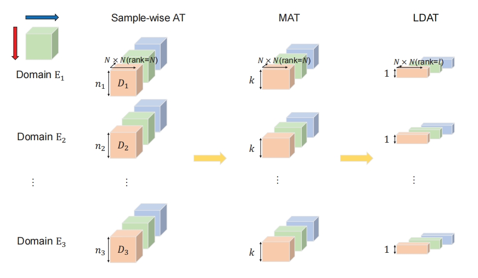

# Code for NeurIPS 2022 Paper: Improving Out-of-Distribution Generalization by Adversarial Training with Structured Priors

****
This repository includes a PyTorch implementation of the NeurIPS 2022 paper [Improving Out-of-Distribution Generalization by Adversarial Training with Structured Priors](https://arxiv.org/abs/2210.06807) authored by [Qixun Wang](https://novaglow646.github.io/QixunWang-Homepage.github.io/), [Yifei Wang](https://yifeiwang77.github.io/), Zhu Hong, and [Yisen Wang](https://yisenwang.github.io/).

The codes are in "domainbed" folder. 

## Quick Start
To get the sweep result on a certain datatset of an algorithm, try running:
<pre><code>python -m domainbed.scripts.sweep launch\
              --data_dir=/your_path_to_data/PACS\
              --output_dir=./domainbed/results/your_result_path/\
              --algorithms MAT\
              --command_launcher multi_gpu\
              --datasets PACS\
              --single_test_envs\
              --n_hparams 8\
              --n_trials 3\
              --kdelta_lower_bound 10\
              --kdelta_upper_bound 10\
              --kat_alpha_step_lb -3\
              --kat_alpha_step_ub -2\
              --at_eps_lb 0.1\
              --at_eps_ub 0.1\
              --at_alpha_lb -1\
              --at_alpha_ub -1\
              --steps 8000\
              --is_cmnist 0\
              --wd_lb 1e-3\
              --wd_ub 1e-3\
              --gpus 2
</pre></code>
This will launch a sweep of MAT on PACS dataset. The script will train models with 8 different sets of hyperparameters and select the optimal model parameters for evaludation using both training-domain validation and test-domain validation. The whole process will run 3 random trials and average result will be reported. Argument --out_put_dir specifies where the evaluation results and checkpoints will be stored at. --data_dir is the dataset direction.

To view the results, run:
<pre><code>python -m domainbed.scripts.collect_results\
       --input_dir=./domainbed/results/your_result_path
</pre></code>

## Arguments
When conducting a sweep, you can specify the hyperparameters of the algorithm. We list the correspondence of some main hyperparameters and their argument name, so you can adjust them at will. 'lb'/'ub' indicate the lower/upper bound of the search space. The range in parentheses indicates that the parameter refers to a power of 10, not the parameter itself.

perturbation radius $\epsilon$ ---- at_eps_lb/at_eps_ub

FGSM step size $\gamma$ ---- at_alpha_lb/at_alpha_ub ($[10^{at-alpha-lb},10^{at-alpha-ub}]$)

MAT perturbation number $k$ ---- kdelta_lower_bound/kdelta_upper_bound

MAT alpha learning rate $\eta$ ---- kat_alpha_step_lb/kat_alpha_step_ub ($[10^{kat-alpha-step-lb},10^{kat-alpha-step-ub}]$)

LDAT rank $l$ ---- cb_rank_lb/cb_rank_ub

LDAT $A$ learning rate $\rho_A$ ---- A_lr_lb/A_lr_ub ($[10^{A-lr-lb},10^{A-lr-ub}]$)

LDAT $B$ learning rate $\rho_B$ ---- B_lr_lb/B_lr_ub ($[10^{B-lr-lb},10^{B-lr-ub}]$)

Network learining rate $r$ ---- lr_lb/lr_ub

Is/isn't CMNIST dataset ---- is_cmnist 1/0

Total training epochs ---- steps

Test on every domain ---- single_test_envs

Test on specified domains ---- test_domains 0,1,2

The default value of all the parameters is in hparams_registry.py.

This code is inherited from Domainbed https://github.com/facebookresearch/DomainBed. We implemented our algorithms MAT and LDAT in algorithms.py.

## Citing this Work

If you find this work useful, please cite the accompanying paper:

<pre><code>@inproceedings{wang2022improving,
  title={Improving Out-of-Distribution Generalization by Adversarial Training with Structured Priors},
  author={Wang, Qixun and Wang, Yifei and Zhu, Hong and Wang, Yisen},
  booktitle={NeurIPS},
  year={2022}
}
</pre></code>
